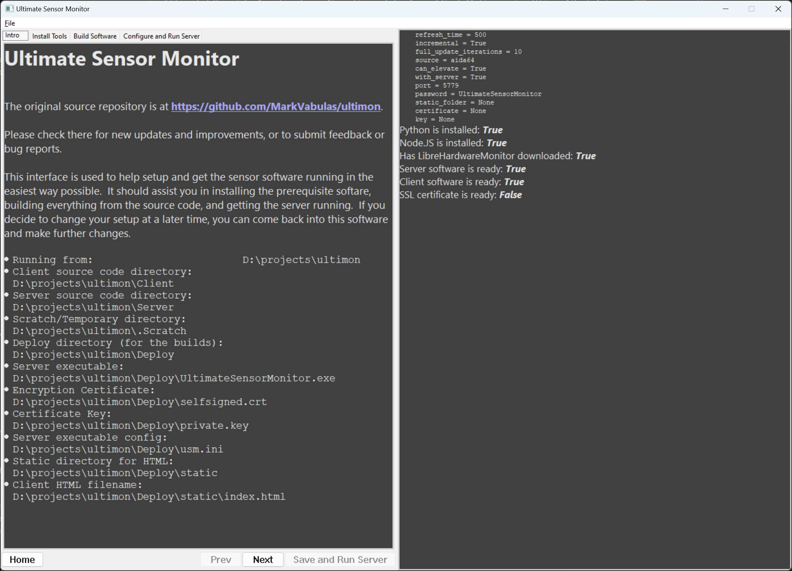

# UltimateSensorMonitor

## Example

This is what it looks like on my machine:  (I adopted/modified the MIT-licensed sensor from [GSkill Wigidash](https://github.com/Sensor-Panels/WigiDash) to make it, THANKS!)  It's at 60fps on my sensor panel, just low FPS for the capture.

## Overiew

UltimateSensorMonitor is a solution designed to fix the inacessible gap between all of your hardware sensors and their respective monitors/destinations.  This software, build from the ground up, is designed to make it easy to get whatever sensor data you want, and access it anywhere you want.  Running HWiNFO64 and want to see the stats on your phone?  Done.  Running Aida64 and hate having the inability to modify the layouts?  Fixed.  Wishing you had audio or video or animation in your client-side visualization?  Trivially easy now.

This suite is designed with a server in python, and expecting to feed data to a website over classic WebSockets to a website.  The server software is capable of serving as an http host as well, providing access to the html page for easily viewing on another device.  All testing has been performed against a Raspberry PI as the viewing source for the main computer's sensors.  The server software is capable of reading the sensor data from HWiNFO64, Aida64, and LibreHardwareMonitor.  If you've already purchased licenses (or not) for those software suites, you can keep using them, and the info will be accessible remotely.  

## Functionality

- [x] Server software in Python
- [x] Sample client index.html (based on Aida64 sensors)
- [ ] Sample client index.html (based on HWiNFO64 sensors)
- [ ] Sample client index.html (based on LibreHardwareMonitor sensors)
- [x] Sample client bundled by webpack, to include any html+js+css automatically
- [x] Reading from HWiNFO64's Shared Memory interface
- [x] Reading from Aida64's Shared Memory interface
- [x] Self-reading sensor data through LibreHardwareMonitor's dll
- [x] Websocket for realtime updates
- [x] Watchdog for changes to index.html, with suggestions to refresh the browser
- [x] Automatic Image-based representation selection for sensor results  (unlimited number of possible images/states)
- [x] Graph drawing tools for time series values
- [ ] Graph drawing tools need better animation management
- [x] Ability to custom-add new functionality to the site, with drop-in javascript files
- [ ] Example client with WebGL rendering showing advanced procedurally generated graphics based on the sensor metrics
- [x] Implemented an example for how to draw things as background and/or screensavers (currently, uses MapTiler)
- [x] Implemented a WebGL example for an animated procedural background (Based on the famous example WebGL Fluid Simulation)
- [x] Added another beautiful example background animation based on advancing wavefronts (https://www.cake23.de/traveling-wavefronts-lit-up.html)
- [x] User interface to make configuration and development/installation easier (things like helping with Node.JS/Python, and command-line arguments)
- [x] A user data configuration file, for things like API keys which can be configured without looking through code (For example, MapTiler API key and URL can be configured AND updated this way)

## Wishlist/To-Do

- [ ] A way to gather the statistics from multiple sources simultaneously
- [ ] Proper wiki for understanding the different parts/capabilities and how to configure/control/edit/use them
- [ ] Easier way to view the possible values, so we can make editing easier
- [ ] Github actions to automatically package the clients, and the Python-based server, into a distributable with an exe+files
- [ ] Easy integration for metrics from multiple USM servers (I have multiple computers, I'd like to see all of their stats on my Raspberry PI at the same time)
- [ ] Changing between multiple pages being served (for those who want more than 1 page)
- [ ] LAN-local WebRTC streaming between any server's screen (in case people want a small PIP, for example, on their sensor client)
- [ ] More uniform method of selecting which metrics we want to put in each place (a lookup table which will convert each type, and name them consistently)

The wishlist is not a dream-level pi-in-the-sky list of things to do.  I already have extensive experience with user interfaces.  I have written WebRTC-based software for the browser, embedded devices, including the signaling software middleware.

## Installation

# Easy

__Welcome to Version 2.0 of the user-interface.__

######Eventually I'll roll them up into a github Action so that there's a definite "release" which is just an executable and a few html files.

0. Download the repository (click the green drop-down above, and selected "Download Zip") into a fresh folder on your computer.
1. In the folder you placed the files in, run "build_gui.bat". This step downloads Python3 if you don't already have it, and then builds the user interface for you, from the sources inside the Server directory.  In the end, you'll have an Executable called "UltimateSensorMonitorGUI.exe" sitting in the folder.  This is what we really want.
2. Run UltimateSensorMonitorGUI.exe by double clicking on it (or from a terminal, but that's less useful for when you want to run it for long periods of time).

Yeah, that's the setup.  We did so much better now!  

### How to use the GUI

There are 4 Tabs in total.

- On the first page you can see a basic description and a list of folders where everything is or will be stored
- On the right is a panel which will show you readouts and progress for various tasks, as well as the status as the server is running.
- On the second tab, which you can reach by hitting "Next" or clicking on "Install Tools", you can read the descriptions of the various tools to install.  Clicking on the buttons (if they're not greyed out because you already have them installed) will handily install them for you, minimum of fuss.
- On the third tab (by hitting next), this is where we create the webserver and the client website.  Clicking on each button will build the respective pieces and place them in the correct locations on your computer.  SSL-based encryption certificates are possible to generate in the software if required, but it can cause a headache for configuration in the browsers by having to import them on the client side as well.  It ***does*** have the added benefit of encryption, so *YMMV*.
- On the last tab, we can see the configuration items for the server.  We should only really be here if all of the other steps have been run first.  If you want to check the status of the various steps, you can access that again in the File menu at the top ("Refresh Components").  The default values are pretty good ones, and should be excellent for your use case.  If you're going to us HWiNFO64 or LibreHardwareMonitor (LMH) then this is the place to change them.  If you've created certificates, you can specify the relevant parts here.  Any changes are live-saved to a file, but you can also click "Save" to make yourself feel better.
  - To start the server, click "Save and Run" on this pane or at the bottom.  This will also stop/restart a server if you have already clicked to run it before.
  - To stop the server, click "Stop Server".  You should be able to see the progress of the server on the right-hand pane.
- To see your client side, open a browser and navigate to `http://localhost:5779` or whatever you set the port number to in the settings.

## After the software is running

The GUI software will minimize (and close!) to the notification bar in the corner.  It is designed to take up 0 processor time, it's just a host for the server and a simple way to be able to start/stop the server as well.  If you want to hard-quit the user interface software, which will also stop the server, you can go to File->"Stop and Quit".  If you still want to run the server (for example, at startup or as a scheduled task), but without using the GUI, once the GUI has setup the software then you can find "UltimateSensorMonitor.exe" inside the `Deploy` folder.  Double-clicking or otherwise running that will load the accompanying "umd.ini" settings file and proceed gracefully.  Secretly, the GUI software is effectively just handling that for you, until I develop a more improved way involving startup tasks etc.

As before, if you want to make changes to the client software while the server is running, you can edit the files inside the Client/src folder. After making changes, click "Build Client HTML" on the third pane again, even if the server is running, and it will live-update connected clients or you can immediately refresh the associated browser.

Feel free to delete the Scratch folder, or even the Deploy folder, since we can just remake them at will in the GUI anyway (nothing in there is assumed to be permanent).

# Advanced

0. For the quick/dirty test, make sure you're running Aida64 (with "Shared Memory" access turned on) on your computer
1. Ensure you have python3 installed on your system
2. Clone this repository into a folder on your computer
3. Inside the Server directory, at a terminal:
  1. Run the command `python3 -m pip install -r requirements.txt`.  This will install the required libraries for running the software.
  2. Run the command `start_server.bat`.  This uses sane defaults for the software, and also tells it to use the current example `index.html` as the client.
4. In a browser, navigate to `http://localhost:5779`  (Done!)

If you would prefer to run the LibreHardwareMonitor version (keep in mind we might not yet have a client which displays the metrics), then change `aida64` inside start_server.bat to `lhm`. You will also need to place the files "LibreHardwareMonitorLib.dll", "LibreHardwareMonitorLib.xml", and "HidSharp.dll" from your LibreHardwareMonitor installation into the folder with the `start_server.bat`.  An alternative would be adding your LibreHardwareMonitor installation directory to your path.  It's also *VERY IMPORTANT* that if you grab the dll's out of a download from your browser, you need to right-click on them and "Unblock" in the properties window, or the software won't be able to load them.
It's important to note that running the LibreHardwareMonitor and HWiNFO64 versions both require permissions elevation to admin in order to read the sensor data/acess the shared memory.
If you want more information on how to run/configure the software, you can ask with `--help` on the command line.

## Editing 

If you decide to make changes to the `index.html` inside `Client\src`, start by running `npm install`; then, you can either run `npm run release` or for live-watching edits, `npm run watch`.  If you are making edits while the Python Server is running, and the Python server detects the changes, then it will notify the browsers and have the browser refresh toget the newest html file.

In a typical scenario, the only things that need to be modified from the current state, for effectively ANY changes, are the `index.html`, `style.css` and any associated image files.

For changing the `index.html` page, the "id" attribute of each tag is what is used for where to send the data.  The class defines what sort of operation exists on it.  Because of a limitation of html, if you want to have the same value in multiple places, you must add a suffix to the name such as _label or _123 to the end, so it can find all instances of that sensor value.
Luckily, a large quantity of the sample sensor id's and how to use them is included right in the example `index.html`.
If you want to know what sensor values you have access to, it's a lot more complex to access, at the moment.  The best source is looking at the data coming in to WebSocketClient.js, inside onmessage.  The field `data.data` inside `_ws.onmessage` will contain the current update of information.  The server typically sends incremental updates of only values that have changed, but if you restart the server with `--incremental 0` in start_server.bat, then you can see all of the possible values.  I recommend a good json viewer, such as JSTool inside Notepad++.

## Development Ethos

For the forseeable future, most of my changes will be made on main, since single-developer project management is simple that way, and breaking things isn't a big deal.

I welcome Issues being filed and Pull Requests being submitting.  I'm curious what I haven't thought of yet.  

As for licensing, to follow the KISS principle, any code contributed back to the repo will fall under the ownership of the repository. 

## License

This software is being licensed under the GNU General Public License v3.0.  This means that any end-user is fully capable to download, install, and use this software however they want.  The license is intended to prevent a large corporation or entity from stealing everything and trying to sell it or bundle it.  I will repeat, if you are a hobbiest, knock yourself out, and feel free to share back any comments/suggestions/bugs/fixes/changes you desire, as well.

I am open to corporate/enterprise licensing, but that would be under a different license and require organization/communication with the entities involved.
